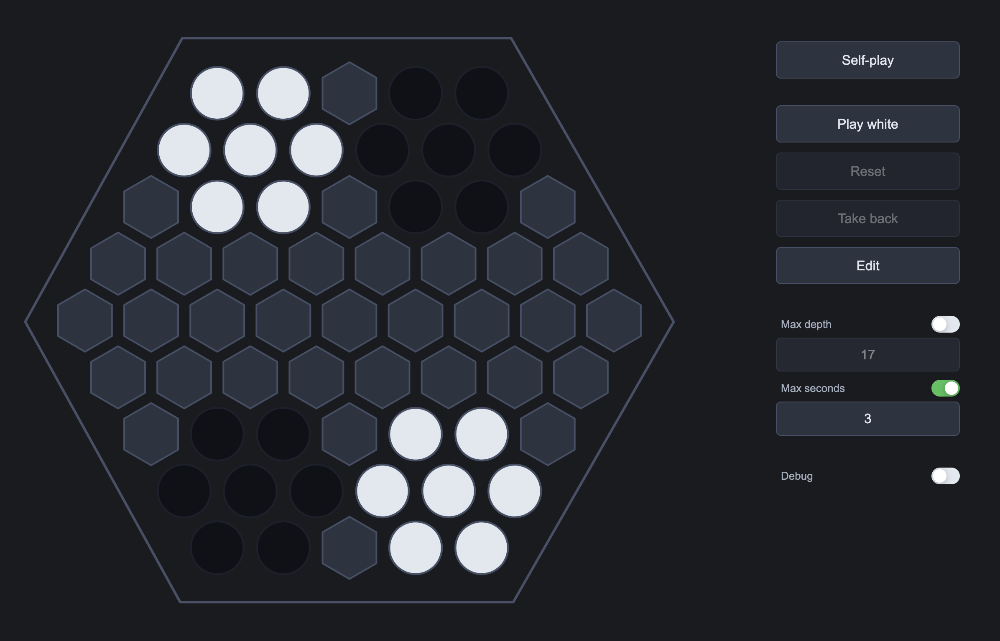

## Play

[](https://steinmann.github.io/steinbeisser-wasm/)

## API

The engine reads one space-delimited line from stdin and writes one space-delimited line to stdout.

Example input, from the Belgian Daisy start with black to move:

```text
ss1SS/sssSSS/1ss1SS1/8/9/8/1SS1ss1/SSSsss/SS1ss 0 0 b 0 1 10000 0
```

| # | Field | Meaning |
|---:|---|---|
| 1 | `board` | `S` black, `s` white, `1-9` empty |
| 2 | `black_score` | White marbles ejected |
| 3 | `white_score` | Black marbles ejected |
| 4 | `side` | Side to move |
| 5 | `no_ejection_ply` | Plies since ejection |
| 6 | `move_number` | Full move |
| 7 | `time_ms` | Budget in ms |
| 8 | `depth` | Max depth; `0` no cap |

Example output:

```text
ss1SS/sssSSS/1ss1SS1/8/9/3S4/1SS1ss1/SSSsss/1S1ss 0 0 w 1 1 698 18 41377792 9985
```

| # | Field | Meaning |
|---:|---|---|
| 1 | `board` | Board after move |
| 2 | `black_score` | Updated black score |
| 3 | `white_score` | Updated white score |
| 4 | `side` | Side to move |
| 5 | `no_ejection_ply` | Plies since ejection |
| 6 | `move_number` | Full move |
| 7 | `score` | Search score |
| 8 | `depth` | Completed depth |
| 9 | `nodes` | Nodes searched |
| 10 | `elapsed_ms` | Engine elapsed time |

Use `depth = 0` for no depth cap. Use `time_ms = 0` with `depth > 0` for fixed-depth search. `time_ms = 0` and `depth = 0` is invalid.

## GitHub Tournament

### Rules

- Engines: All 14 playable GitHub Abalone engines.
- Format: Round robin.
- Openings: All 60 Wall of Variations FEN positions from [`data/positions`](data/positions).
- Games: Each matchup played every opening once from each side, for 120 games per matchup.
- Time control: 100 ms per move.
- Winning: Eject 6 enemy marbles, or lead on ejections after the 350-ply cap. Tied ejections are a draw.
- Output: One clean JSON file per matchup in [`data/games`](data/games).

### Results

| # | Author | Engine | Elo | W-D-L | Score | Score % |
|---:|---|---|---:|---:|---:|---:|
| 1 | steinmann | [steinbeisser][steinbeisser-wasm] | 3290 | 1556-3-1 | 1557.5/1560 | 99.84% |
| 2 | peso | [EL BOANA][el_boana] | 2516 | 1365-11-184 | 1370.5/1560 | 87.85% |
| 3 | elchairoy | [Gnizabalone][Gnizabalone] | 2500 | 1352-5-203 | 1354.5/1560 | 86.83% |
| 4 | AlSaeed | [Heuristic Minimax Player][15618-Final-Project] | 2397 | 1214-21-325 | 1224.5/1560 | 78.49% |
| 5 | soniquentin | [Artificial Intelligence Agent][Abalone_AI_Minimax] | 2264 | 945-74-541 | 982/1560 | 62.95% |
| 6 | poly-mehdi | [Abalone AI Agent][abalone-ai-agent] | 2257 | 927-80-553 | 967/1560 | 61.99% |
| 7 | Retam1 | [Abalone Agent Project][abalone-agent] | 2184 | 753-105-702 | 805.5/1560 | 51.63% |
| 8 | altin | [Abalone-AI][abalone-ai] | 2104 | 545-165-850 | 627.5/1560 | 40.22% |
| 9 | ilagko | [Abalone Game Backend][AbaloneWeb] | 2096 | 520-183-857 | 611.5/1560 | 39.20% |
| 10 | MichielVerloop | [Abalone AI][AbaloneAI] | 1962 | 233-249-1078 | 357.5/1560 | 22.92% |
| 11 | GenericusNamus | [Abalone Agent][genericusnamus-abalone-agent] | 1948 | 209-256-1095 | 337/1560 | 21.60% |
| 12 | JeanBrrt | [Abalone's agent][Abalone] | 1923 | 4-593-963 | 300.5/1560 | 19.26% |
| 13 | negjafari | [Abalone Game with Godot][AI-abalone] | 1859 | 3-434-1123 | 220/1560 | 14.10% |
| 14 | AlirezaNR1 | [Abalone AI Project][Abalone-AI] | 1844 | 3-403-1154 | 204.5/1560 | 13.11% |

[steinbeisser-wasm]: https://github.com/steinmann/steinbeisser-wasm
[el_boana]: https://github.com/peso/el_boana
[Gnizabalone]: https://github.com/elchairoy/Gnizabalone
[15618-Final-Project]: https://github.com/AlSaeed/15618-Final-Project
[Abalone_AI_Minimax]: https://github.com/soniquentin/Abalone_AI_Minimax
[abalone-ai-agent]: https://gitlab.com/poly-mehdi/abalone-ai-agent
[abalone-agent]: https://github.com/Retam1/abalone-agent
[abalone-ai]: https://github.com/altin/abalone-ai
[AbaloneWeb]: https://github.com/ilagko/AbaloneWeb
[AbaloneAI]: https://github.com/MichielVerloop/AbaloneAI
[genericusnamus-abalone-agent]: https://codeberg.org/GenericusNamus/abalone-agent
[Abalone]: https://github.com/JeanBrrt/Abalone
[AI-abalone]: https://github.com/negjafari/AI-abalone
[Abalone-AI]: https://github.com/AlirezaNR1/Abalone-AI

## CodinGame Abalone League
https://www.codingame.com/multiplayer/bot-programming/abalone/leaderboard
