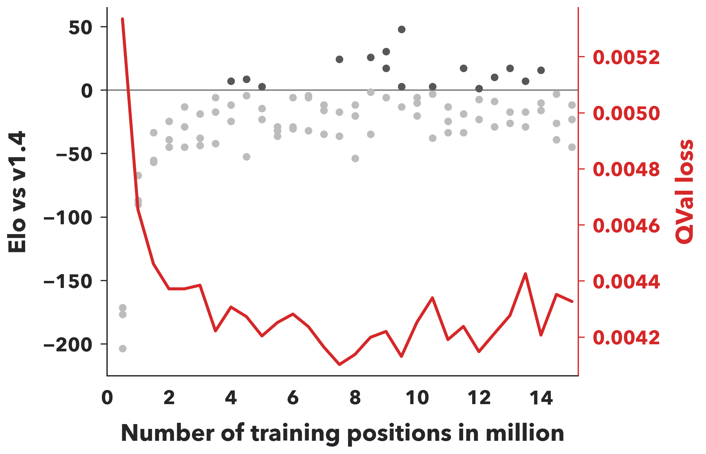
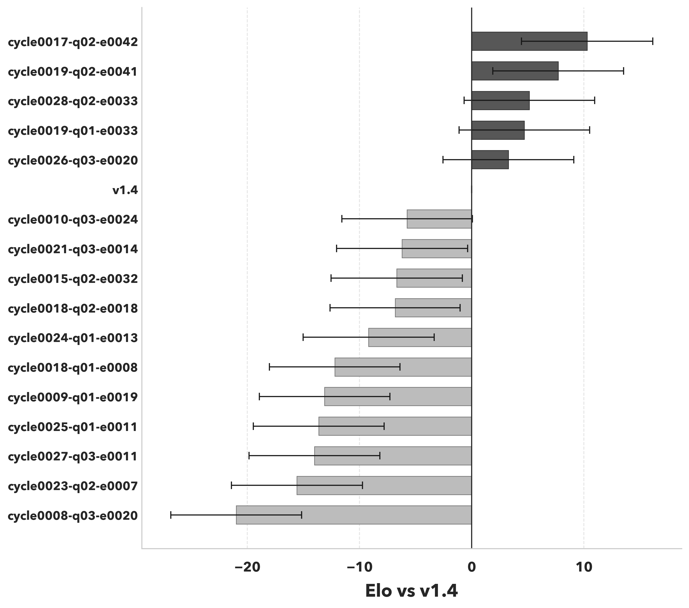

# Steinbeisser v1.5

Steinbeisser v1.5 promotes the NNUE tournament winner
`cycle0017-q02-e0042` to the release network.

- Model: `data/training/v15/network.nnq`
- Release net: `engine/src/net.mlp`
- Training prefix: 8.5M positions
- QVal loss: `0.0042179053`
- Screen Elo: `+26.0` vs `v1.4`

The final positive-hit round robin placed `cycle0017-q02-e0042` first:

| Player | Elo vs v1.4 | Games | Score | W-D-L |
|---|---:|---:|---:|---:|
| `cycle0017-q02-e0042` | `+10.3` | 10016 | 52.27% | 3921-2628-3467 |
| `v1.4` | `+0.0` | 10016 | 50.79% | 3725-2724-3567 |

The release round robin at 50 ms/move, using the first 1000 openings from
`data/random100K.fen`, also ranked the promoted net first across `v1.0` through
`v1.4`:

| Player | Elo vs v1.4 | Games | Score | W-D-L |
|---|---:|---:|---:|---:|
| `v1.5` | `+7.0` | 10000 | 56.49% | 4522-2254-3224 |
| `v1.4` | `+0.0` | 10000 | 55.50% | 4396-2307-3297 |
| `v1.3` | `-34.0` | 10000 | 50.63% | 3868-2390-3742 |
| `v1.2` | `-53.0` | 10000 | 47.90% | 3560-2459-3981 |
| `v1.1` | `-63.4` | 10000 | 46.40% | 3467-2345-4188 |
| `v1.0` | `-86.6` | 10000 | 43.10% | 3176-2267-4557 |

Directly against `v1.4` in that 50 ms tournament slice, `v1.5` scored
763-470-767 over 2000 games, which is effectively even (`-0.7` Elo,
95% CI `[-10.9, +10.1]`). The promotion is based on the full tournament result
and the positive-hit training tournament.

## Plots

[Screening plot SVG](v1.5/elo_screen.svg)

[Tournament bar plot SVG](v1.5/elo_tournament.svg)

## Release Contents

- Embeds the promoted v1.5 NNUE in `engine/src/net.mlp`.
- Keeps `data/training/v15` as a five-file training bundle:
  `train.sbin`, `val.sbin`, `network.nnq`, `elo_screen.png`, and
  `elo_tournament.png`.
- Includes the NNUE training, data-preparation, screening, selfplay, plotting,
  and export tooling under `nnue/`.
- Keeps the old `tools/selfplay.rs` and `tools/trainer.py` paths removed; their
  maintained replacements are now in `nnue/`.
