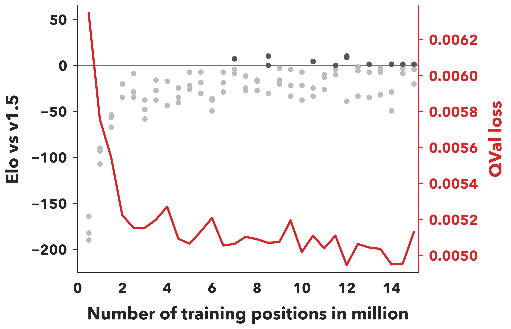
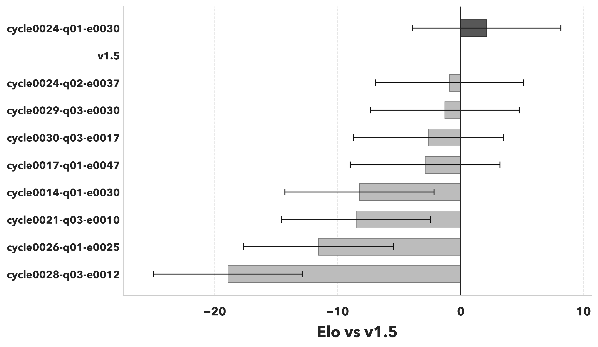

# Steinbeisser v1.6

Steinbeisser v1.6 promotes the NNUE tournament winner
`cycle0024-q01-e0030` to the release network.

- Model: `data/training/v16/network.nnq`
- Release net: `engine/src/net.mlp`
- Training prefix: 12.0M positions
- QVal loss: `0.004946`
- Screen Elo: `+10.1` vs `v1.5`

The final positive-hit round robin placed `cycle0024-q01-e0030` first:

| Player | Elo vs v1.5 | Games | Score | W-D-L |
|---|---:|---:|---:|---:|
| `cycle0024-q01-e0030` | `+2.1` | 10008 | 51.06% | 4041-2139-3828 |
| `v1.5` | `+0.0` | 10008 | 50.76% | 4018-2124-3866 |
| `cycle0024-q02-e0037` | `-0.9` | 10008 | 50.63% | 4002-2130-3876 |
| `cycle0029-q03-e0030` | `-1.3` | 10008 | 50.57% | 4021-2081-3906 |
| `cycle0030-q03-e0017` | `-2.6` | 10008 | 50.38% | 4045-1995-3968 |
| `cycle0017-q01-e0047` | `-2.9` | 10008 | 50.34% | 4041-1995-3972 |
| `cycle0014-q01-e0030` | `-8.2` | 10008 | 49.58% | 3931-2061-4016 |
| `cycle0021-q03-e0010` | `-8.5` | 10008 | 49.54% | 3940-2035-4033 |
| `cycle0026-q01-e0025` | `-11.6` | 10008 | 49.10% | 3903-2021-4084 |
| `cycle0028-q03-e0012` | `-18.9` | 10008 | 48.04% | 3731-2153-4124 |

The release round robin at 50 ms/move, using the first 1000 openings from
`data/random100K.fen`, ranked the promoted net first across `v1.0` through
`v1.5`:

| Player | Elo vs v1.5 | Elo vs v1.0 | Games | Score | W-D-L |
|---|---:|---:|---:|---:|---:|
| `v1.6` | `+2.0` | `+91.7` | 12000 | 55.47% | 5297-2719-3984 |
| `v1.5` | `+0.0` | `+89.8` | 12000 | 55.19% | 5259-2728-4013 |
| `v1.4` | `-3.5` | `+86.2` | 12000 | 54.69% | 5169-2787-4044 |
| `v1.3` | `-39.7` | `+50.1` | 12000 | 49.50% | 4511-2859-4630 |
| `v1.2` | `-56.0` | `+33.8` | 12000 | 47.15% | 4206-2904-4890 |
| `v1.1` | `-66.5` | `+23.2` | 12000 | 45.65% | 4082-2791-5127 |
| `v1.0` | `-89.8` | `+0.0` | 12000 | 42.35% | 3746-2672-5582 |

## Plots

## Release Contents

- Embeds the promoted v1.6 NNUE in `engine/src/net.mlp`.
- Keeps `data/training/v16` as a five-file training bundle:
  `train.sbin`, `val.sbin`, `network.nnq`, `elo_screen.png`, and
  `elo_tournament.png`.
- Fixes final positive-hit tournament scheduling so each engine gets at least
  10,000 games, with unique paired openings within each matchup.
- Includes the NNUE training, data-preparation, screening, selfplay, plotting,
  and export tooling under `nnue/`.
